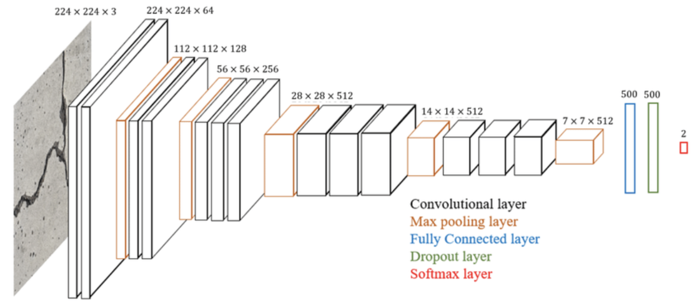
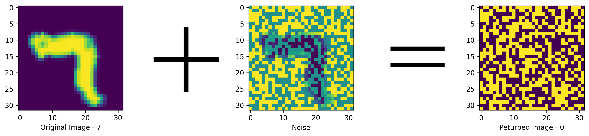

<div id="top"></div>

<br />
<div align="center">

<h2 align="center">Defense Against Adversarial Attacks using Convolutional Auto-Encoders</h2>

  <p align="center">
    Official code implementation
    <br />
    <br />
    <a href="https://arxiv.org/abs/2312.03520">View Paper</a>
    ·
    <a href="https://github.com/Shreyasi2002/Adversarial_Attack_Defense/issues">Report Bug</a>
    ·
    <a href="https://github.com/Shreyasi2002/Adversarial_Attack_Defense/pulls">Request Feature</a>
  </p>
</div>


<!-- TABLE OF CONTENTS -->
<summary><b>Table of Contents</b></summary>
<ol>
  <li>
    <a href="#about">About</a>
  </li>
  <li>
    <a href="#usage-instructions">Usage Instructions</a>
    <ul>
      <li><a href="#project-structure">Project Structure</a></li>
      <li><a href="#install-dependencies">Install Dependencies</a></li>
      <li><a href="#train-vgg16">Train VGG16</a></li>
      <li><a href="#adverse-attacks">Adverse Attacks</a></li>
      <li><a href="#train-and-test-autoencoder">Train and Test AutoEncoder</a></li>
    </ul>
  </li>
  <li>
    <a href="#results">Results</a>
  </li>
  <li>
    <a href="#citation">Citation</a>
  </li>
</ol>

## About
Deep learning models, while achieving state-of-the-art performance on many tasks, are susceptible to adversarial attacks that exploit inherent vulnerabilities in their architectures. 
Adversarial attacks manipulate the input data with imperceptible perturbations, causing the model to misclassify the data or produce erroneous outputs. Szegedy et al. (https://arxiv.org/abs/1312.6199) discovered 
that Deep Neural Network models can be manipulated into making wrong predictions by adding small perturbations to the input image.

<div align="center">

  
Fig 1: Szegedy et al. were able to fool AlexNet by classifying a perturbed image of a dog into an ostrich
</div>
An U-shaped convolutional auto-encoder is used to reconstruct original input from the adversarial images generated by FGSM and PGD attacks, effectively removing the adversarial perturbations. 
The goal of the autoencoder network is to minimise the mean squared error loss between the original unperturbed image and the reconstructed image, 
which is generated using an adversarial example. While doing so, a random Gaussian noise is added after encoding the image so as to make the model more robust. 
The idea behind adding the noise is to perturb the latent representation by a small magnitude, and then decode the perturbed latent representation, 
akin to how the adversarial examples are generated in the first place.

<div align="center">

  
Fig 2: Architecture of the proposed Convolutional AutoEncoder
</div>

## Usage Instructions 

### Project Structure
```
📂 Adversarial-Defense
|_📁 AElib                   
  |_📄 VGG.py                # VGG16 architecture for training on MNIST and Fashion-MNIST datasets
  |_📄 autoencoder.py        # Architecture of Convolutional AutoEncoder with GELU activation
  |_📄 utils.py              # Utility functions
  |_📄 attacks.py            # Implementation of PGD and FGSM Attacks
|_📁 images
|_📁 models                  # Trained VGG16 models and the AutoEncoder models for different attacks and datasets
|_📁 notebooks               # Jupyter notebooks containing detailed explanations with visualisations
  |_📄 fgsm-attack-on-mnist-and-fashion-mnist-dataset.ipynb
  |_📄 pgd-attack-on-mnist-and-fashion-mnist.ipynb
  |_📄 vgg16-on-mnist-and-fashion-mnist.ipynb
  |_📄 defense-against-adversarial-attacks-autoencoder.ipynb
|_📄 adverse_attack.py       # Applying Adversarial attacks on the desired dataset
|_📄 train_vgg16.py          # Training VGG16 for multi-class classification
|_📄 LICENSE
|_📄 requirements.txt  
|_📄 autoencoder.py          # Training and Testing AutoEncoder for Adversarial Defense
|_📄 .gitignore

```

If you are more comfortable with Jupyter notebooks, you can refer to the `notebooks` folder in this repository :)

### Install dependencies
Run the following command - 
```bash
pip install -r requirements.txt
```
Since the pre-trained VGG16 models were of large size, they were not uploaded in this repository. You can download them from here - https://www.kaggle.com/datasets/shreyasi2002/vgg16-models-mnist-fashion-mnist

**IMP**: This project uses GPU to train and test the models. 

To test the availability of GPU, run the following command - `!nvidia-smi`
<br/>
If you see an output like this, you are good to go :)
```
+---------------------------------------------------------------------------------------+
| NVIDIA-SMI 535.104.05             Driver Version: 535.104.05   CUDA Version: 12.2     |
|-----------------------------------------+----------------------+----------------------+
| GPU  Name                 Persistence-M | Bus-Id        Disp.A | Volatile Uncorr. ECC |
| Fan  Temp   Perf          Pwr:Usage/Cap |         Memory-Usage | GPU-Util  Compute M. |
|                                         |                      |               MIG M. |
|=========================================+======================+======================|
|   0  Tesla T4                       Off | 00000000:00:04.0 Off |                    0 |
| N/A   38C    P8               9W /  70W |      0MiB / 15360MiB |      0%      Default |
|                                         |                      |                  N/A |
+-----------------------------------------+----------------------+----------------------+
                                                                                         
+---------------------------------------------------------------------------------------+
| Processes:                                                                            |
|  GPU   GI   CI        PID   Type   Process name                            GPU Memory |
|        ID   ID                                                             Usage      |
|=======================================================================================|
|  No running processes found                                                           |
+---------------------------------------------------------------------------------------+
```


### Train VGG16
VGG16 is one of the popular algorithms for image classification and is easy to use with transfer learning. 
<div align="center">
  
  
  Fig 3: VGG16 Architecture
</div>

Run the following command to train the VGG16 model from scratch -
```bash
!python train_vgg16.py [-h] [--dataset {mnist,fashion-mnist}] [--lr LR] [--epochs EPOCHS]
```
1. `--dataset` argument to use the dataset of your choice from MNIST dataset or Fashion MNIST dataset. (default is MNIST)
2. `--lr` argument to set the learning rate (default is 0.001)
3. `--epochs` argument to set the number of epochs (default is 10)

You can also use the `-h` command to refer to the documentation.

Example Usage : `!python train_vgg16.py --dataset mnist --lr 0.0001 --epochs 20`

More information about this can also be found here - https://www.kaggle.com/code/shreyasi2002/vgg16-on-mnist-and-fashion-mnist 


### Adverse Attacks
This project supports two types of attacks :
1. FGSM (Fast Gradient Sign Method) Adversarial Attack (https://www.kaggle.com/code/shreyasi2002/fgsm-attack-on-mnist-and-fashion-mnist-dataset)
2. PGD (Projected Gradient Descent) Attack (https://www.kaggle.com/code/shreyasi2002/pgd-attack-on-mnist-and-fashion-mnist)

To apply attack to any dataset, use the following command - 
```bash
!python adverse_attack.py [-h] [--attack {fgsm,pgd}] [--dataset {mnist,fashion-mnist}]
                          [--epsilon EPSILON]
```
1. `--attack` argument to set the type of attack from PGD or FGSM (default is PGD since it is a stronger attack)
2. `--dataset` argument to use the dataset of your choice from MNIST dataset or Fashion MNIST dataset. (default is MNIST)
3. `--epsilon` argument to determine the strength of the attack. If FGSM attack is used, keep this value in the range [0, 0.8]. If PGD attack is used, keep this value in the range [0, 0.3].

You can also use the `-h` command to refer to the documentation.

Example Usage : `!python adverse_attack.py --attack pgd --dataset fashion-mnist --epsilon 0.3`

The higher the `epsilon (ε)` value, the stronger is the attack. As evident from Fig 4, using large epsilon (ε) values (here 1.0) leads to corruption of the label semantics making it impossible to retrieve the original image. Hence, it is recommended to keep the ε below 1.0
<div align="center">
  
  
  Fig 4: FSM Attack (ε = 1.0) on the MNIST dataset
</div>
Since the PGD attacked adversarial examples are more natural-looking as seen in Fig 5, I have created a dataset with the adversarial examples for the MNIST Dataset. Feel free to play around with it :)
<div align="center">
  
  
  Fig 5: PGD Attack (ε = 0.3) on the Fashion MNIST dataset
</div>
Link to Dataset - https://www.kaggle.com/datasets/shreyasi2002/corrupted-mnist 


### Train and Test AutoEncoder
Use the following command to train the autoencoder model from scratch -
```bash
!python autoencoder.py [-h] [--attack {fgsm,pgd}]
                       [--dataset {mnist,fashion-mnist}]
                       --action train
                       [--use_pretrained {True,False}] [--epsilon EPSILON]
                       [--epochs EPOCHS]
```
Use the following command to test the model -
```bash
!python autoencoder.py [-h] [--attack {fgsm,pgd}]
                       [--dataset {mnist,fashion-mnist}]
                       --action test
                       --use_pretrained True
```
1. `--attack` argument to set the type of attack from PGD or FGSM (default is PGD since it is a stronger attack)
2. `--dataset` argument to use the dataset of your choice from MNIST dataset or Fashion MNIST dataset. (default is MNIST)
3. `--action` argument is to either train the model or test a pre-trained model.
4. `--use_pretrained` argument is set to True if you want to test your model or train a model from an existing pre-trained model
5. `--epsilon` argument to determine the strength of the attack (only during training)
6. `--epochs` argument to set the number of epochs (only during training)

Example Usages:
1. `!python autoencoder.py --attack fgsm --dataset fashion-mnist --action train --use_pretrained False --epsilon 0.6 --epochs 10`
2. `!python autoencoder.py --attack pgd --dataset mnist --action test --use_pretrained True`

More details can be found here - https://www.kaggle.com/code/shreyasi2002/defense-against-adversarial-attacks-autoencoder

## Results
The AutoEncoder successfully reconstructs the images almost similar to the original images as shown below - 
<div align="center">
  
  
  
  
  Fig 6: Comparison of the adversarial image, reconstructed image and the original image
</div>
The accuracy of the pre-trained VGG-16 classifier on the MNIST and Fashion-MNIST dataset with FGSM attack increases by 65.61% and 59.76% respectively. For the PGD attack, the accuracy increases by 89.88% and 43.49%. This shows the efficacy of our model in defending the adversarial attacks with high accuracy.
<div align="center">
<table>
    <thead>
        <tr>
            <td><b>Attack</b></td>
            <td colspan=2><b>Accuracy (w/o defense)</b></td>
            <td colspan=2><b>Accuracy (with defense)</b></td>
        </tr>
    </thead>
    <tbody>
        <tr>
            <td></td>
            <td>MNIST</td>
            <td>Fashion-MNIST</td>
            <td>MNIST</td>
            <td>Fashion-MNIST</td>
        </tr>
        <tr>
            <td>FGSM (ε = 0.60)</td>
            <td>0.2648</td>
            <td>0.1417</td>
            <td>0.9209</td>
            <td>0.7393</td>
        </tr>
        <tr>
            <td>PGD (ε = 0.15)</td>
            <td>0.0418</td>
            <td>0.2942</td>
            <td>0.9406</td>
            <td>0.7291</td>
        </tr>
    </tbody>
</table>
</div>


## Citation
Please cite this paper as -
```
Mandal, Shreyasi. "Defense Against Adversarial Attacks using
Convolutional Auto-Encoders." arXiv preprint arXiv:2312.03520 (2023).
```
